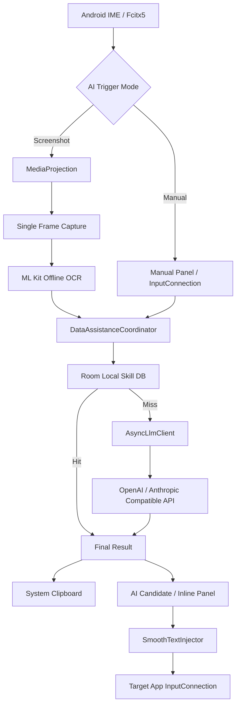

# Smart Keyboard

> AI-assisted Android keyboard based on Fcitx5 for Android.
>
> 基于 **Fcitx5 for Android** 的 AI 增强输入法：在保留完整输入法能力的基础上，把屏幕 OCR、当前输入框读取、本地知识库检索、云端 LLM 和输入法上屏能力串成一个闭环。


---

## 项目简介

**Smart Keyboard** 不是重新实现一套输入法，而是在 `fcitx5-android` 上增加一层独立的 AI 数据辅助能力。

项目主要面向这类场景：

- 老旧业务系统、企业内网控制台、全屏应用；
- 目标 App 没有公开 API；
- 页面文字难以复制，或只能通过屏幕看到；
- 目标输入框禁止/不方便直接粘贴；
- 希望在不离开当前 App 的情况下完成“读取 → 查询 → 生成 → 输入”。

核心思路是把 **输入法本身作为跨 App 的交互入口**：

```text
当前屏幕 / 当前输入框 / 手动问题
                ↓
        本地上下文提取
        ├─ MediaProjection 单帧截图
        ├─ ML Kit 离线 OCR
        └─ InputConnection 文本读取
                ↓
        本地 Skill 知识库
                ↓ 未命中
        云端 LLM API
                ↓
        剪贴板 / AI 候选 / 内联结果
                ↓
        commitText() 平滑上屏
```

本项目的 AI 增强目前全部位于 Android `:app` 的 Kotlin/Java 层，**没有修改 Fcitx5 C++ 输入法核心**。

---

## 与原版 Fcitx5 for Android 的区别

上游项目：[`fcitx5-android/fcitx5-android`](https://github.com/fcitx5-android/fcitx5-android)

| 能力 | Fcitx5 for Android | Smart Keyboard |
|---|---:|---:|
| 中文拼音 / 双拼 / 五笔等 | ✅ | ✅ 继承 |
| RIME / 多语言输入 | ✅ | ✅ 继承 |
| 候选栏 / Emoji / 符号 | ✅ | ✅ 继承 |
| 剪贴板管理 | ✅ | ✅ 继承并用于 AI 结果 |
| 主题 / 键盘 UI | ✅ | ✅ 继承 |
| AI 配置页 | ❌ | ✅ |
| 手动 AI 问题输入 | ❌ | ✅ |
| 读取当前目标输入框 | ❌ | ✅ |
| MediaProjection 屏幕捕获 | ❌ | ✅ |
| 本地离线 OCR | ❌ | ✅ |
| 本地 Skill 知识库 | ❌ | ✅ |
| 本地优先、LLM 兜底 | ❌ | ✅ |
| LLM 流式返回 | ❌ | ✅ |
| AI 结果插入候选栏 | ❌ | ✅（截图模式） |
| AI 内联结果区域 | ❌ | ✅（截图模式） |
| 限速逐字 `commitText()` | ❌ | ✅ |
| AI 专用键盘手势 / 菜单 | ❌ | ✅ |

因此它更接近一个 **依附在 Android IME 上的跨 App AI 数据助手**，而不是只做文本润色或翻译的普通“AI 键盘”。

---

## 核心功能

### 1. 完整保留 Fcitx5 Android 输入能力

Smart Keyboard 继续使用上游 Fcitx5 Android 的输入框架、候选系统、剪贴板、主题、多语言输入和插件体系。

AI 功能只在需要时参与流程，不要求替换原本的输入法核心。

### 2. 截图 OCR 模式

截图模式适合“文字只能看见，但无法直接读取”的场景。

流程：

1. 在键盘菜单中启用 **AI 截图模式**；
2. 长按空格触发数据辅助；
3. 如尚未授权，系统弹出 `MediaProjection` 屏幕捕获授权；
4. 使用 `ImageReader + VirtualDisplay` 捕获单帧屏幕；
5. 使用 **Google ML Kit Chinese Text Recognition** 在本机离线 OCR；
6. 优先搜索本地 Skill 知识库；
7. 本地未命中才请求云端模型；
8. 流式结果进入 AI 候选 / 键盘内联区域；
9. 最终结果同时复制到系统剪贴板；
10. 点击 AI 候选后，通过 `InputConnection.commitText()` 逐字输入到目标 App。

**截图图像本身不会发送给 LLM。** 云端请求使用的是 OCR 后得到的文本。

### 3. 手动 AI 模式

手动模式不依赖 OCR，适合主动输入问题，或者抓取当前编辑框中的文本后交给 AI。

当前代码中的推荐操作：

1. 键盘右上角“更多”菜单选择 **AI 手动模式**；
2. 长按句号 `.` 打开键盘内部的手动输入栏；
3. 直接用键盘输入问题；
4. 也可以在手动模式下点击逗号 `,`，读取当前目标 App 的输入框内容并填入手动输入栏；
5. 点击手动输入栏右侧的 **发送**；
6. 本地 Skill 优先匹配，未命中再请求 LLM；
7. 当前实现会把手动模式结果优先写入**系统剪贴板**。

> 注意：当前 `main` 代码里，手动模式使用 `clipboardOnly` 路径，因此不会像截图模式一样保留 AI 候选和内联结果。历史使用文档中关于“手动模式结果进入候选栏第 0 项”的描述属于早期设计，与当前实现存在差异。

另外，当前手动模式下长按空格走的是“读取当前目标输入框并发送”的路径；如果你正在使用键盘内部的手动输入栏，建议直接点击 **发送** 按钮。

### 4. 当前输入框读取

项目通过 Android `InputConnection` 尝试获取目标编辑框内容：

1. 优先使用 `getExtractedText()`；
2. 如果失败，回退到 `getTextBeforeCursor()` + `getTextAfterCursor()`；
3. 如果目标 App 完全不暴露文本，则读取结果可能为空。

这使得项目在部分不方便复制的应用中，可以直接从输入法层读取当前文本上下文。

### 5. 本地 Skill 知识库

项目内置 Room 数据库：

```text
ai_local_skills.db
```

数据结构主要由：

```text
keyword -> answer
```

组成。

查询流程：

- Room `@Fts4` 全文检索优先；
- FTS 没有结果时使用 `LIKE` 查询兜底；
- 对候选 Skill 进行关键词包含关系和简单 token overlap 打分；
- 命中本地答案后，**不再调用云端模型**。

这样可以把固定业务答案、字段规则、内部操作说明等内容保存在设备本地。

### 6. 本地 Skill 导入

AI 设置页面支持：

- 追加导入；
- 替换整个本地 Skill 库；
- 清空本地 Skill 库。

#### JSON 数组

```json
[
  {
    "keyword": "日期怎么填",
    "answer": "请填写当前业务日期，格式为 YYYY-MM-DD。"
  },
  {
    "keyword": "季度字段",
    "answer": "2026 年 7 月属于第三季度。"
  }
]
```

#### 带 `skills` 的 JSON 对象

```json
{
  "skills": [
    {
      "keyword": "发票抬头",
      "answer": "发票抬头请填写企业全称。"
    }
  ]
}
```

#### 简单文本

```text
日期怎么填=>请填写当前业务日期，格式为 YYYY-MM-DD。
季度字段|2026 年 7 月属于第三季度。
发票抬头:发票抬头请填写企业全称。
客户编号<TAB>客户编号请使用系统显示的编号。
```

### 7. 云端 LLM

当前网络层使用 **OkHttp**，支持两种兼容接口格式。

#### Anthropic 兼容格式

当 Base URL 以 `/anthropic` 结尾时，代码自动使用：

```text
POST {baseUrl}/v1/messages
x-api-key: <API_KEY>
anthropic-version: 2023-06-01
```

默认配置：

```text
供应商：DeepSeek
Base URL：https://api.deepseek.com/anthropic
模型：deepseek-v4-flash
```

#### OpenAI 兼容格式

其他 Base URL 自动走：

```text
POST {baseUrl}/chat/completions
Authorization: Bearer <API_KEY>
```

请求支持：

- 非流式响应；
- SSE 流式响应；
- 连接 / 读取 / 写入超时；
- 简单重试；
- OpenAI 与 Anthropic 两类响应解析。

> 当前 `provider` 字段主要用于配置展示；实际协议选择由 **Base URL 是否以 `/anthropic` 结尾**决定。

### 8. AI 候选栏覆盖

截图模式产生 AI 结果后，`AiCandidateOverlay` 会把 AI 文本插入横向候选栏最前面。

点击该项不会调用 Fcitx 的普通候选选择，而是触发 AI 专用的平滑上屏流程。

当前只集成了**横向候选栏**，展开候选等其他候选视图尚未完整接入。

### 9. 平滑逐字上屏

`SmoothTextInjector` 会：

```text
finishComposingText()
↓
逐字符 commitText()
↓
每字符随机延迟约 120~150 ms
```

主要用于：

- 目标系统不允许直接粘贴；
- 一次提交大量文本容易失败；
- 希望模拟连续输入而不是整段 paste。

任何新的注入任务都会取消旧任务；`InputConnection` 拒绝提交时也会停止。

### 10. 快速重置 / Panic Reset

项目提供 AI 会话重置逻辑，用于立即清理当前辅助状态，包括：

- 取消正在执行的 AI Job；
- 清空 AI 候选；
- 清空内联结果；
- 隐藏手动输入栏；
- 取消平滑文本注入；
- 停止并清理当前 `MediaProjection` 会话。

---

## 两种模式的当前行为

| 项目 | 截图模式 | 手动模式 |
|---|---:|---:|
| 单帧屏幕捕获 | ✅ | ❌ |
| 本地 ML Kit OCR | ✅ | ❌ |
| 读取当前 InputConnection | ❌ | ✅ |
| 键盘内部手动输入栏 | ❌ | ✅ |
| 本地 Skill 优先 | ✅ | ✅ |
| 云端 LLM 兜底 | ✅ | ✅ |
| SSE 流式请求 | ✅ | ✅ |
| AI 横向候选 | ✅ | 当前关闭 |
| AI 键盘内联区域 | ✅ | 当前关闭 |
| 自动写系统剪贴板 | ✅ | ✅ |
| 点击 AI 候选逐字上屏 | ✅ | 当前无 AI 候选 |

README 以当前 `main` 源码行为为准；仓库中的 `AI_DATA_ASSISTANCE_PROGRESS*.md` 和早期使用说明同时保留了开发过程记录，因此部分细节可能与当前代码不同。

---

## 键盘交互

### 键盘“更多”菜单

可以切换：

```text
AI 截图模式
AI 手动模式
关闭 AI 模式
AI 设置
状态区域
```

### 句号 `.`

```text
短按：普通句号
长按：打开 AI 手动输入栏，并启用手动模式
```

### 逗号 `,`

```text
AI 手动模式开启：读取当前目标输入框并放入手动输入栏
AI 手动模式关闭：作为普通逗号发送
```

### 空格

```text
短按：普通空格
长按：触发 AI 数据辅助
```

当前在手动模式下，长按空格使用“当前目标输入框”作为输入；键盘内部手动输入栏请使用右侧 **发送** 按钮提交。

---

## AI 设置

设置页入口有两种：

1. 输入法主设置页 → **AI 数据辅助**；
2. 键盘更多菜单 → **AI 设置**。

可以配置：

- AI 总开关；
- 截图模式 / 手动模式；
- Provider 名称；
- Base URL；
- 模型名称；
- API Key；
- System Prompt；
- 功能说明；
- 本地 Skill 数据；
- API 连通性测试。

System Prompt 支持：

```text
[OCR_RESULT]
```

占位符。执行时会替换为当前 OCR / 输入上下文。

默认 System Prompt：

```text
You are a closed-loop data assistance module. Read OCR_RESULT and return only the final text that should be inserted into the active field. Do not explain. OCR_RESULT: [OCR_RESULT]
```

---

## 架构



### AI 模块目录

```text
app/src/main/java/org/fcitx/fcitx5/android/extension/ai/
├── AiCandidateOverlay.kt
├── AiConfigStore.kt
├── AiInlinePanel.kt
├── AiManualInputPanel.kt
├── AiMediaProjectionStore.kt
├── AiSettingsActivity.kt
├── AiTriggerMode.kt
├── AsyncLlmClient.kt
├── DataAssistanceCoordinator.kt
├── LocalSkillDatabase.kt
├── ScreenCaptureOcrPipeline.kt
├── ScreenCapturePermissionActivity.kt
├── SkillImportManager.kt
└── SmoothTextInjector.kt
```

### 主要接入点

```text
app/src/main/java/org/fcitx/fcitx5/android/input/
├── InputView.kt
│   ├── AI 内联结果区域
│   └── AI 手动输入栏
├── bar/KawaiiBarComponent.kt
│   └── AI 模式 / 设置菜单
├── candidates/horizontal/HorizontalCandidateComponent.kt
│   └── AI 候选注入与点击处理
└── keyboard/
    ├── CommonKeyActionListener.kt
    ├── BaseKeyboard.kt
    ├── KeyboardWindow.kt
    ├── KeyAction.kt
    └── KeyDefPreset.kt
```

---

## 隐私与安全

### 截图

截图模式的图像在本机完成 OCR，当前代码不会把 Bitmap / Screenshot 上传给云端模型。

### OCR 文本

如果本地 Skill 没有命中，**OCR 后的文本会作为模型上下文发送到配置的云端 API**。

因此不要把“图片不上传”理解为“任何数据都不会离开设备”。

### 本地知识库

Room Skill 数据库存储在设备本地。命中本地答案时，不需要调用云端 LLM。

### API Key

当前 API Key 保存在 Android `SharedPreferences` 中，**尚未使用 Android Keystore / EncryptedSharedPreferences 做额外加密保护**。

对于正式生产环境、企业设备或高敏感密钥，建议先实现安全凭据存储后再使用。

---

## 构建环境

当前项目跟随所使用的 Fcitx5 Android 基线和仓库配置。

### 关键版本

```text
compileSdk = 36
targetSdk = 36
buildTools = 36.1.0
CMake = 3.31.6
NDK = 28.0.13004108
Android Gradle Plugin = 9.2.0
Kotlin = 2.3.21
KSP = 2.3.7
Room = 2.8.4
OkHttp = 4.12.0
ML Kit Chinese Text Recognition = 16.0.1
```

### 克隆

项目包含多个 Git submodule，建议：

```bash
git clone https://github.com/RICHARDwuxiaofei/smart-keyboard.git
cd smart-keyboard
git submodule update --init --recursive
```

Windows 开发时需要启用 Git symlink 支持：

```powershell
git config --global core.symlinks true
```

### 编译 Kotlin 层

Windows + Android Studio JBR 示例：

```powershell
$env:JAVA_HOME="C:\Program Files\Android\Android Studio\jbr"
$env:PATH="$env:JAVA_HOME\bin;$env:PATH"
.\gradlew.bat :app:compileDebugKotlin
```

### 构建 Debug APK

```powershell
.\gradlew.bat :app:assembleDebug
```

常规输出目录：

```text
app/build/outputs/apk/debug/
```

### SDK / Gradle 排障

仓库里保留了针对当前开发环境的详细说明：

- [`ANDROID_SDK_OFFLINE_SETUP_ZH.md`](./ANDROID_SDK_OFFLINE_SETUP_ZH.md)

当前版本固定使用 AGP `9.2.0`。如果出现：

```text
Plugin [id: 'com.android.application', version: '9.2.0'] was not found
```

优先检查 Google Maven / Gradle 仓库访问，而不是把它误判成 Kotlin 源码错误。

---

## 当前项目状态

这是一个仍在开发中的实验性分支。

当前已经具备：

- Fcitx5 Android 完整基础输入能力；
- AI 模式开关和设置页；
- 截图授权与单帧捕获；
- ML Kit 离线 OCR；
- 手动输入面板；
- 当前编辑框读取；
- Room + FTS4 本地 Skill 数据库；
- JSON / TXT Skill 导入；
- OpenAI / Anthropic 兼容 LLM 请求；
- SSE 流式响应；
- AI 横向候选；
- 键盘内联 AI 结果；
- 系统剪贴板结果输出；
- 逐字 `commitText()` 注入；
- AI 会话快速重置。

### 当前已知限制

- GitHub Releases 目前没有正式发布包；
- 当前仓库的 Fcitx5 基线早于上游最新版本，需要后续同步上游；
- 上游后续修改过键盘触摸/手势相关代码，同步时可能与本项目 `BaseKeyboard` 等修改产生冲突；
- 当前本地全文索引使用 Room `FTS4`，不是 FTS5；
- AI 候选目前主要集成在横向候选栏；
- 手动模式当前是 `clipboardOnly` 输出路径；
- `provider` 配置尚未抽象成真正的 Provider Adapter；
- API Key 尚未接 Android Keystore；
- OCR 当前使用中文文字识别器；
- 目标 App 如果不提供有效 `InputConnection` 文本接口，当前输入框读取可能失败；
- 不同 App 对 `commitText()` 的接受行为不同，平滑注入并不能保证兼容所有输入框；
- 历史开发文档中的部分行为描述可能落后于当前源码。

---

## 上游同步说明

本仓库不是 GitHub UI 中的正式 Fork，但代码历史继承自 `fcitx5-android`。

AI 增强是在上游历史基础上继续开发，并尽量把自定义逻辑集中在：

```text
org.fcitx.fcitx5.android.extension.ai
```

以降低对 Fcitx5 核心的侵入。

后续同步上游时，建议优先检查这些冲突热点：

```text
InputView.kt
KawaiiBarComponent.kt
HorizontalCandidateComponent.kt
BaseKeyboard.kt
CommonKeyActionListener.kt
KeyDefPreset.kt
KeyboardWindow.kt
```

---

## 开发文档

仓库现有开发记录：

- [`AI_DATA_ASSISTANCE_PROGRESS.md`](./AI_DATA_ASSISTANCE_PROGRESS.md) — AI 功能早期开发进度（英文）
- [`AI_DATA_ASSISTANCE_PROGRESS_ZH.md`](./AI_DATA_ASSISTANCE_PROGRESS_ZH.md) — AI 功能早期开发进度（中文）
- [`AI_DATA_ASSISTANCE_USAGE_ZH.md`](./AI_DATA_ASSISTANCE_USAGE_ZH.md) — 早期功能使用说明
- [`ANDROID_SDK_OFFLINE_SETUP_ZH.md`](./ANDROID_SDK_OFFLINE_SETUP_ZH.md) — Android SDK / Gradle 环境排障

> 如果文档与源码冲突，请以当前 `main` 源码和本 README 的“当前行为”说明为准。

---

## Roadmap

后续比较值得做的方向：

- [ ] 同步最新 Fcitx5 Android 上游；
- [ ] 为自定义代码补充单元测试 / instrumentation test；
- [ ] 使用 Android Keystore 安全保存 API Key；
- [ ] 抽象真正的 Provider 层，而不是依赖 Base URL 判断 API 格式；
- [ ] 让手动模式可选候选栏 / 内联输出，而不只走剪贴板；
- [ ] 完善展开候选、浮动候选等 AI 结果显示；
- [ ] 增加 OCR 语言 / 区域配置；
- [ ] 增加更完整的错误状态 UI；
- [ ] 增加 GitHub Actions 自动构建；
- [ ] 发布可安装的测试 Release；
- [ ] 清理并更新历史开发文档。

---

## Upstream & Credits

Smart Keyboard 基于：

- [Fcitx5 for Android](https://github.com/fcitx5-android/fcitx5-android)
- [Fcitx5](https://github.com/fcitx/fcitx5)

感谢 Fcitx5 / Fcitx5 Android 项目及其所有贡献者。

**本项目不是 Fcitx5 Android 官方项目。**

---

## License

项目沿用上游许可证体系，仓库根目录包含 [`LICENSE`](./LICENSE)。

主要代码按 **LGPL-2.1-or-later** 许可发布；具体文件的版权和 SPDX 声明以各源文件及 `LICENSE` 为准。
